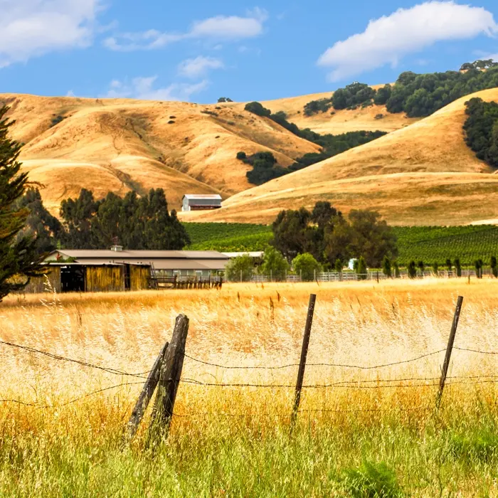
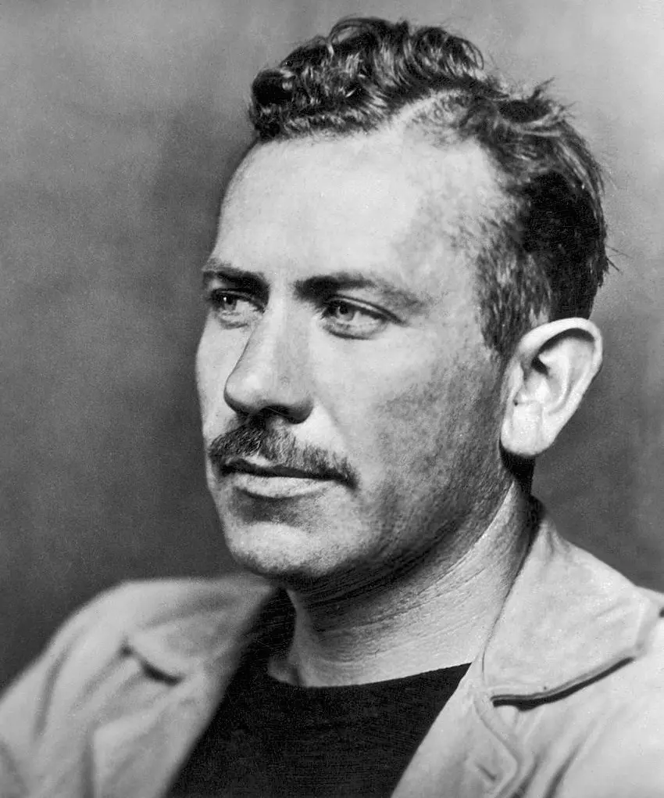
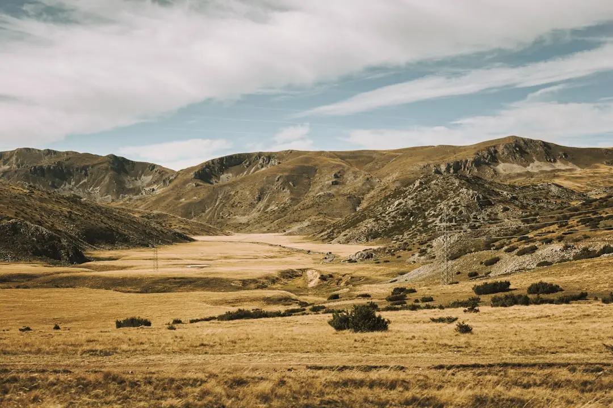
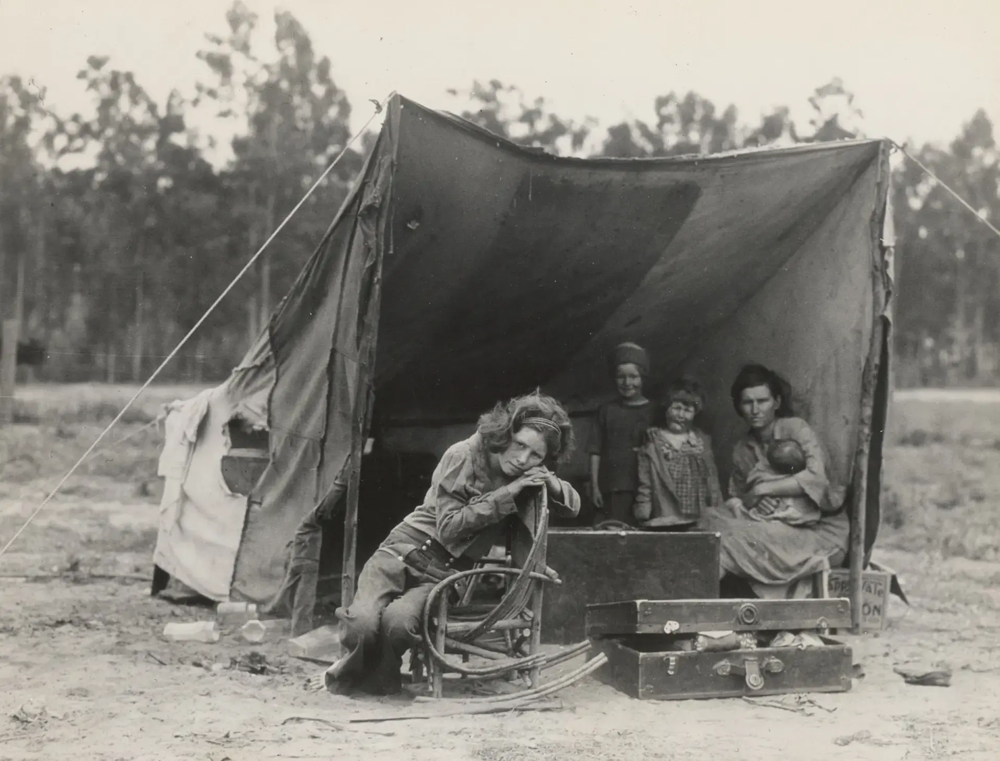
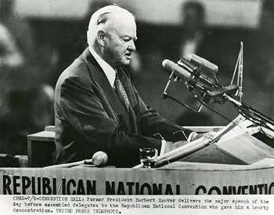
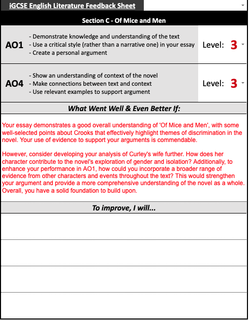

--- 
marp: true
theme: rab
author: Max Bruges
title: Of Mice and Men - Text
footer: ' '
paginate: true
---



# Of Mice and Men <br> Reading the Text 📖

<blockquote class=scroll>

<!-- TOC -->
1. [Of Mice and Men <br> Reading the Text 📖](#of-mice-and-men-br-reading-the-text-)
1. [Opening the novel](#opening-the-novel)
1. [Establishing setting](#establishing-setting)
1. [Looking at the text](#looking-at-the-text)
1. [How to write a contextual paragraph](#how-to-write-a-contextual-paragraph)
1. [Continuing our essays](#continuing-our-essays)
1. [George and Lennie: mutual dependence](#george-and-lennie-mutual-dependence)
1. [Arrival on the Ranch](#arrival-on-the-ranch)
1. [Meeting Candy](#meeting-candy)
1. [Considering isolation](#considering-isolation)
1. [Capitalism and The Boss](#capitalism-and-the-boss)
1. [Violence and power](#violence-and-power)
1. [The characters so far](#the-characters-so-far)
1. [Pity and isolation](#pity-and-isolation)
1. ["He wouldn't feel nothing"](#he-wouldnt-feel-nothing)
1. [Conflict and Curley](#conflict-and-curley)
1. [Chapter 4: segregation and separation](#chapter-4-segregation-and-separation)
1. [Intersectional connection](#intersectional-connection)
1. [Preparing for assessment](#preparing-for-assessment)
1. [Summarising the novel](#summarising-the-novel)
1. [Is *Of Mice and Men* a tragedy?](#is-of-mice-and-men-a-tragedy)
1. [The Trial of George Milton vs The State of California](#the-trial-of-george-milton-vs-the-state-of-california)
1. [Assessment Feedback](#assessment-feedback)
<!-- /TOC -->


</blockquote>

---


# Opening the novel

**LO:** To consider the opening of the text.

<task> What does a good opening of a novel need to do? Write a bulleted list.

<challenge> How did `Macbeth` open? What did Shakespeare choose to show and why?

> **EDENIC** - (Adjective) A natural paradise; peaceful, calm and at one with nature. Comparing somewhere to the Garden of Eden.

--- 

## What's in a name?

> "But Mouse, you are not alone,
In proving foresight may be vain:
The best laid plans **of mice and men**
Often go awry,
And leave us nothing but grief and pain,
For promised joy"
>> Robert Burns, '[To A Mouse](https://en.wikipedia.org/wiki/To_a_Mouse#:~:text=But%20Mouse,joy)'


<task> 

The title of the novel is taken from a poem about a mouse whose nest is destroyed by a farmer's plough. 

What ideas or themes does this suggest to the reader will appear in the novel? Will it be a happy novel?

</task>

---

<scroll>

> "A few miles south of Soledad, the Salinas River drops in close to the hillside bank and runs deep and green. The water is warm too, for it has slipped twinkling over the yellow sands in the sunlight before reaching the narrow pool. On one side of the river the golden foothill slopes curve up to the strong and rocky Gabilan Mountains, but on the valley side the water is lined with trees— willows fresh and green with every spring, carrying in their lower leaf junctures the debris of the winter’s flooding; and sycamores with mottled, white, recumbent limbs and branches that arch over the pool. On the sandy bank under the trees the leaves lie deep and so crisp that a lizard makes a great skittering if he runs among them. Rabbits come out of the brush to sit on the sand in the evening, and the damp flats are covered with the night tracks of ‘coons, and with the spreadpads of dogs from the ranches, and with the split-wedge tracks of deer that come to drink in the dark. 
> There is a path through the willows and among the sycamores, a path beaten hard by boys coming down from the ranches to swim in the deep pool, and beaten hard by tramps who come wearily down from the highway in the evening to jungle-up near water. In front of the low horizontal limb of a giant sycamore there is an ash pile made by many fires; the limb is worn smooth by men who have sat on it."
>> [Chapter 1](../textbook/of-mice-and-men-text#:~:text=a%20few%20miles,sat%20on%20it) 

</scroll>

---


# Establishing setting

<task> Finish your knowledge organiser from yesterday's lesson </task>

<challenge> Include a list of key vocabulary AND a reference to the title </challenge>

---

## Looking at exam questions

<columns>

> ## Q1) Explore the theme of nature in the novel
> - You must consider context in your answer
>> [40 marks]

- Questions are thematic or character-focussed
- Whatever the question, **context is essential**
- Notice it doesn't focus on a specific scene or section, but the **whole novel**

</columns>

<task> What do we know about nature in the novel so far? </task>

---



## Starting with the big ideas

<task> 

We know that Steinbeck...
- Wrote novels that....
    - [`Clue 1`](https://maxbruges.com/hangman?cmVhbGlzbQ==)
- Grew up....
    - [`Clue 2`](https://maxbruges.com/hangman?c2FsaW5hcw==)
- Was interested in....
    - [`Clue 3`](https://maxbruges.com/hangman?YW1lcmljYQ==)

 </task>

---


# Looking at the text

> "A few miles south of Soledad, the Salinas River drops in close to the hillside bank and runs deep and green. The water is warm too..."
>> [Chapter 1](../textbook/of-mice-and-men-text#:~:text=a%20few%20miles)

<task> 

Open your copy of the novel and re-read the first page.

Why does Steinbeck start the novel this way: with nature and no people?

Brainstorm some ideas with your partner, then write down two reasons.

1. _Steinbeck opens the novel this way to make the reader think..._
1. _Or, he could have started the novel this way to suggest..._

</task>

---

## The Full Text

Open your device and save this as a bookmark

[` 🐁 Of Mice and Men - Full Text`](https://mxb.fyi/textbook/of-mice-and-men-text)

```
https://mxb.fyi/textbook/of-mice-and-men-text
```

(It's also on our Teams!)

---

> "Evening of a hot day started the little wind to moving among the leaves. The shade climbed up the hills toward the top. On the sand banks the rabbits sat as quietly as little gray, sculptured stones. And then from the direction of the state highway came the sound of footsteps on crisp sycamore leaves. The rabbits hurried noiselessly for cover. A stilted heron labored up into the air and pounded down river. For a moment the place was lifeless, and then two men emerged from the path and came into the opening by the green pool.
> They had walked in single file down the path, and even in the open one stayed behind the other. Both were dressed in denim trousers and in denim coats with brass buttons. Both wore black, shapeless hats and both carried tight blanket rolls slung over their shoulders. The first man was small and quick, dark of face, with restless eyes and sharp, strong features. Every part of him was defined: small, strong hands, slender arms, a thin and bony nose. Behind him walked his opposite, a huge man, shapeless of face, with large, pale eyes, with wide, sloping shoulders; and he walked heavily, dragging his feet a little, the way a bear drags his paws. His arms did not swing at his sides, but hung loosely."
>> [Chapter 1](../textbook/of-mice-and-men-text#:~:text=Evening%20of%20a,loosely)

---

# How to write a contextual paragraph

LO: To consider how we weave context into our answers

```url
mxb.fyi/omam
```

<columns>

<task> 

How are George and Lennie described in the opening paragraphs? Write down four bullets.

</task>

<challenge> 

Use this word in your answer: 
[`Z_________`](https://maxbruges.com/hangman?em9vbW9ycGhpc20=)

</challenge>

</columns>


---

## Arrival of the men 

<columns>

> "Evening of a hot day started the little wind to moving among the leaves. The shade climbed up the hills toward the top. On the sand banks the rabbits sat as quietly as little gray, sculptured stones. And then from the direction of the state highway came the sound of footsteps on crisp sycamore leaves. The rabbits hurried noiselessly for cover. A stilted heron labored up into the air and pounded down river. For a moment the place was lifeless, and then two men emerged from the path and came into the opening by the green pool..."
>> [Chapter 1](../textbook/of-mice-and-men-text#:~:text=Evening%20of%20a,loosely)

<task> 

What THREE things could you say about **nature** in this section? 

- How does nature react to humans?
- How are the humans described?
- Is it positive or negative?

<challenge> Give an _alternative_ interpretation too. </challenge>

</task>

</columns>

---

>"They had walked in single file down the path, and even in the open one stayed behind the other. Both were dressed in denim trousers and in denim coats with brass buttons. Both wore black, shapeless hats and both carried tight blanket rolls slung over their shoulders. The first man was small and quick, dark of face, with restless eyes and sharp, strong features. Every part of him was defined: small, strong hands, slender arms, a thin and bony nose. Behind him walked his opposite, a huge man, shapeless of face, with large, pale eyes, with wide, sloping shoulders; and he walked heavily, dragging his feet a little, the way a bear drags his paws. His arms did not swing at his sides, but hung loosely."
>> [Chapter 1](../textbook/of-mice-and-men-text#:~:text=They,-had%20walked%20in,loosely)

<task> Build on and add to your ideas from the previous slide. </task>

---

## Crafting an essay, with a `PECK` 🐦

<blockquote>

- `P`**oint** - *what are you saying about the novel?*
- `E`**vidence** - *what part of the novel are you linking to?*
- `C`**ontext** - *what historical/social/authorial context is relevant?*
- `K`**nowledge** - *what other bits of the novel could this link with?*

</blockquote>

<task> Copy this structure down! </task>
<challenge> What context is relevant? </challenge>


> **Q1) Explore the theme of nature in the novel**
You must consider context in your answer


---

## ⏸️ Pause & think: What do we mean when we say `context`?

- Context is **not** just facts about the time period or the author

```pre
   [ C O N T E X T ]
  /                 \
 /                   \
```

<columns>

> CON = with or together

> TEXT = written material

</columns>

- **Context** must be information that we combine **with** the main piece of writing.

- Context has to be relevant and connected to the *text* (the novel) - we aren't writing a history essay!

---

## Selecting relevant context

- Our question is about the theme of `NATURE` in the novel 🌳

<columns>

<task> 

**Rank** (1 to 7) the contextual information opposite by relevance to the question, and write a short explanation for why.

*i.e. `1` for information we will DEFINITELY use, `7` for information we definitely won't use.*

<challenge> Pick your least relevant piece of information, and find some way to link it to the question </challenge>

</task>


<div>

> The Wall Street Crash

> The Dustbowl

> The American Dream

> Steinbeck's Childhood

> The First World War

> Segregation

> California

</div>

</columns>

---

## Planning our paragraph 🐦

<columns>

<blockquote>

- `P`**oint** - *what are you saying about the novel?*
- `E`**vidence** - *what part of the novel are you linking to?*
- `C`**ontext** - *what historical/social/authorial context is relevant?*
- `K`**nowledge** - *what other bits of the novel could this link with?*

</blockquote>

- _Steinbeck presents nature as..._
- _I would argue that..._
- _He does this by..._
- _Readers in 1937 would have thought..._
- _This could also link to..._

<columns>

---

# Continuing our essays

<task> 

Re-read the ranked list of contextual points we created last lesson.

Which will you use for your SECOND paragraph?</task>

<challenge> Can you add any additional contextual points to it? </challenge>

---


## A model paragraph


>  In the opening of the novel, Steinbeck presents the nature of California as an Edenic paradise. He achieves this by beginning the narrative not with descriptions of the human characters, but rather with the beautiful and undisturbed natural world of the Salinas Valley. Readers in 1937 would have thought of California as a place of untouched natural beauty and fertile soil, in contrast to the industrialised, urban East Coast, and the Dustbowl-ravaged Midwest. However, the arrival of George and Lennie causes the scene to become "lifeless". This could reflect the natural cost and damage caused by the American Dream of endless progress. In this moment, Steinbeck encapsulates the story of American colonisation of the continent: men arrives and drive away nature.

<task> Highlight and annotate the `Point`, `Evidence`, `Context` and `Knowledge` links. </task>

<challenge> How could it be improved? </challenge>

---

## Adding a second paragraph

<columns>

<blockquote>

- `P`**oint** - *what are you saying about the novel?*
- `E`**vidence** - *what part of the novel are you linking to?*
- `C`**ontext** - *what historical/social/authorial context is relevant?*
- `K`**nowledge** - *what other bits of the novel could this link with?*

</blockquote>

- _Steinbeck presents nature as..._
- _I would argue that..._
- _He does this by..._
- _Readers in 1937 would have thought..._
- _This could also link to..._

<columns>

---



# George and Lennie: mutual dependence

LO: to consider how Steinbeck introduces the relationship between the two main characters

<task> Why were solo, itinerant labourers so common in the mid-1930s? </task>

<challenge> How would this change the way someone thinks about society, and the world? </challenge>

---

## Tracking developments

<task> As we read, note down what we learn about the men. </task>

| 👨 George | 🤼‍♂️ *Together* 🤼‍♂️ | Lennie 🐻 |
| :--- | :--- | :--- |
| Leads the way when they travel | Dressed in the same hard-wearing working clothes | Follows George constantly. |
| ? | ? | ? |
| ? | ? | ? |
| ? | ? | ? |

---


# Arrival on the Ranch

LO: to consider how Steinbeck introduces the Ranch

To follow along with the text, go to...

```url
mxb.fyi/omam#2
```

> [](task) What similarities do George and Lennie exhibit?

>[](challenge) Who would you cast to play them in a film?

---



# Meeting Candy

> [](task) Finish off your illustration of the bunkhouse, *including* annotations

> [](challenge) Can you compare the description in this paragraph with the description of the valley at the beginning? 

[`🌐 mxb.fyi/omam`](https://mxb.fyi/omam)

---

## Describing the bunk house

<columns>

> [](task) What can we learn about the lives of the men on the ranch, based on this description? Write at least 5 bullets.


> [](challenge) Why describe the room with no-one in it? Why does Steinbeck do this?

</columns>

> The bunk house was a long, rectangular building. Inside, the walls were whitewashed and the floor unpainted. In three walls there were small, square windows, and in the fourth, a solid door with a wooden latch. Against the walls were eight bunks, five of them made up with blankets and the other three showing their burlap ticking. Over each bunk there was nailed an apple box with the opening forward so that it made two shelves for the personal belongings of the occupant of the bunk. And these shelves were loaded with little articles, soap and talcum powder, razors and those Western magazines ranch men love to read and scoff at and secretly believe. And there were medicines on the shelves, and little vials, combs; and from nails on the box sides, a few neckties. Near one wall there was a black cast-iron stove, its stovepipe going straight up through the ceiling. In the middle of the room stood a big square table littered with playing cards, and around it were grouped boxes for the players to sit on.
>> [p144, Chapter 2](https://mxb.fyi/textbook/of-mice-and-men-text#p144)

---

## Enter Candy

> [](task) Why isn't Candy given a name here?
> Why is he introduced like this?
> What does it tell us about life on the ranch?

> The door opened and a tall, stoop-shouldered old man came in. He was dressed in blue jeans and he carried a big push-broom in his left hand. Behind him came George, and behind George, Lennie.
> “The boss was expectin’ you last night,” the old man said. “He was sore as hell when you wasn’t here to go out this morning.” He pointed with his right arm, and out of the sleeve came a round stick-like wrist, but no hand. “You can have them two beds there,” he said, indicating two bunks near the stove.
> George stepped over and threw his blankets down on the burlap sack of straw that was a mattress. He looked into his box shelf and then picked a small yellow can from it. “Say. What the hell’s this?”   “I don’t know,” said the old man.
>> [Paragraphs 146 - 149](https://mxb.fyi/textbook/of-mice-and-men-text#p146), Chapter 2

---


# Considering isolation
LO: To create an answer looking at Candy and the setting of the bunkhouse


> [](task) Write a five sentence description from Lennie's perspective of his arrival on the ranch.

>[](challenge) Write an addition three sentences from George's perspective.


>[](important) Check our Teams page to see the [comprehension questions](textbook/omam-comprehension) that you need to complete before half term. You will need to read the novel to finish it!


---

## "Whitewashed and the floor unpainted"

Let's write a micro-essay, answering this question:
> ### How does Steinbeck explore the theme of isolation in Chapter 2?

> [](task) Brainstorm and write down:
> - **THREE** pieces of context that would be relevant
> - **TWO** points you could argue ("Steinbeck wants the reader to think/feel that...")
> - **ONE** link to the opening of the novel

---



---




# Capitalism and The Boss

> [](task) Think back to Mr. Birling. What were his *aims* as a `capitalist`?

> [](challenge) If a society is founded on `capitalist` principles, can people be blamed if they operate in capitalist ways?


> “A man has to mind his own business and look after himself and his own... If we were all responsible for everything that happened to everybody… it would be very awkward wouldn’t it?”
>> Mr. Birling, Act One, An Inspector Calls (1946)


---


> ### President Herbert Hoover - 1928
> During [World War I] we turned to the government to solve every problem... we regimented our whole people into a socialistic state. If continued in peace-time it would destroy our progress and freedom and our American system... of **rugged individualism**.
> Only through ordered liberty, freedom and equal opportunity to the **individual** will his initiative and enterprise spur on **the march of progress**.
>> [President Herbert Hoover, speaking at the Republican National Convention, 1928](https://www.digitalhistory.uh.edu/disp_textbook_print.cfm?smtid=3&psid=1334)

>[](important) **INDIVIDUALISM:** (noun) political belief in the importance of giving individuals the freedom to act, instead of being controlled by the government.

---


## "Rugged Individualism"

<columns>

<div>

> [](task) Re-read this section of a speech given by President Hoover (the man in charge for the beginning of the Great Depression). Define `rugged individualism` in your own words.
> - _I think rugged individualism means...._

> [](stretch) How have we seen this shown in the novel so far? Do we think Steinbeck agrees with this idea?

>[](challenge) Hoover lost the next election to Roosevelt and his 'New Deal'. Why?

</div>

> During [the First World War] we turned to the government to solve every problem... we regimented our whole people into a socialistic state. If continued in peace-time it would destroy our progress and freedom and our American system... of **rugged individualism**.
> Only through ordered liberty, freedom and equal opportunity to the **individual** will his initiative and enterprise spur on **the march of progress**.
>> [President Herbert Hoover, speaking at the Republican National Convention, 1928](https://www.digitalhistory.uh.edu/disp_textbook_print.cfm?smtid=3&psid=1334)

</columns>

---

## The entrance of the boss

<columns>

>[](task) Read the scene with the boss, from George's question to when the boss leaves. Then, answer these questions:
> 1. Select three adjectives used to describe the boss
> 1. How does Steinbeck present the boss through dialogue? Why does he speak in questions?
> 1. What do we learn about George and Lennie based on their interaction with him?

> [`Read 📖 ¶161 --> ¶198 `](https://mxb.fyi/textbook/of-mice-and-men-text#p161)
> `¶161` “What kind of a guy is the boss?” George asked.  
>“Well, he’s a pretty nice fella. Gets pretty mad sometimes, but he’s pretty nice...
>[...]
> `¶198`...You was gonna leave your big flapper shut and leave me do the talkin’. Damn near lost us the job.”
>> [¶161-198, Chp 2](https://mxb.fyi/textbook/of-mice-and-men-text#p161)

</columns>

---


## Plenary

> [](task) Summarise in bulletpoints what you've learnt today:
> - Rugged individualism is...
> - The boss is presented as...
> - Steinbeck suggests to us...


---

# Violence and power

>[](task) Where does the Boss's power come from? 

>[](challenge) what power do George and Lennie have, if any?

---

## Reading on

>[](task) Read [the rest of Chapter 2](https://mxb.fyi/textbook/of-mice-and-men-text#p214) (from Curley's entrance to the end) and answer these Qs
1. Describe the first impression of Curley when he enters the bunkhouse- what adjectives could you use to describe his character?
1. How does George react to Curley’s attitude? What does this reveal about his personality and his relationship with Lennie?
1. What is the significance of Curley’s wife’s introduction in this chapter? How do the men in the bunkhouse react to her?
1. Describe the atmosphere in the bunkhouse following Curley’s entrance.
1. How does Slim contrast with Curley?

>[](challenge) How does the chapter introduce the theme of power and dominance among the characters? Give specific examples to support your answer.

---

## Writing an answer

> ### How does Steinbeck explore the theme of isolation in Chapter 2?


### Remember to P.E.C.K. 🐦
- `P`**oint** - *what are you saying about the novel?*
- `E`**vidence** - *what part of the novel are you linking to?*
- `C`**ontext** - *what historical/social/authorial context is relevant?*
- `K`**nowledge** - *what other bits of the novel could this link with?*

---


# The characters so far

LO: To review the figures on the ranch

>[](task) Bulletpoint the characters that have been introduced in Chapters 1 and 2.

>[](challenge) Rank them in a **hierarchy**

---

## Taking notes

We're going to review all the characters in the first two chapters.

>[](task) Draw this table for Lennie

```pre
Appearance    |  Relationships & status
              |
              |
              |
              |
______________|___________________
  Quotations  |  Role on the ranch
              |
              |
              |
              |
```

---

## Who we know already

> [](task) Complete these for the other characters. [`The Text 📖`](https://mxb.fyi/textbook/of-mice-and-men-text#2)

<columns>

|  George | 🧔🏻‍♂️ |
| ---: | :--- |
| *Appearance* | *Quotations* |
| *Relationships and status* | *Role on ranch* |


|  Candy | 👴🏻 |
| ---: | :--- |
| *Appearance* | *Quotations* |
| *Relationships and status* | *Role on ranch* |


|  The Boss | 💰 |
| ---: | :--- |
| *Appearance* | *Quotations* |
| *Relationships and status* | *Role on ranch* |


|  Curley | 👊 |
| ---: | :--- |
| *Appearance* | *Quotations* |
| *Relationships and status* | *Role on ranch* |


|  Curley's wife | 💃 |
| ---: | :--- |
| *Appearance* | *Quotations* |
| *Relationships and status* | *Role on ranch* |


|  Slim | 🤠 |
| ---: | :--- |
| *Appearance* | *Quotations* |
| *Relationships and status* | *Role on ranch* |

</columns>

---

## Looking at Slim

> A tall man stood in the doorway. He held a crushed Stetson hat under his arm while he combed his long, black, damp hair straight back. Like the others he wore blue jeans and a short denim jacket. When he had finished combing his hair he moved into the room, and he moved with a majesty only achieved by royalty and master craftsmen. He was a jerkline skinner, the prince of the ranch, capable of driving ten, sixteen, even twenty mules with a single line to the leaders. He was capable of killing a fly on the wheeler’s butt with a bull whip without touching the mule. There was a gravity in his manner and a quiet so profound that all talk stopped when he spoke. His authority was so great that his word was taken on any subject, be it politics or love. This was Slim, the jerkline skinner. His hatchet face was ageless. He might have been thirty-five or fifty. His ear heard more than was said to him, and his slow speech had overtones not of thought, but of understanding beyond thought. His hands, large and lean, were as delicate in their action as those of a temple dancer.

---

# Pity and isolation

LO: To consider how Steinbeck presents ideas around isolation and independence

>[](task) Read the below section. Why is George and Lennie's relationship *unusual* for the time? What does it tell us was the normal way for men to live?

> “Funny how you an’ him string along together,” [said Slim]. 
“What’s funny about it?” George demanded defensively.
“Oh, I dunno. Hardly none of the guys ever travel together. I hardly never seen two guys travel together. You know how the hands are, they just come in and get their bunk and work a month, and then they quit and go out alone. Never seem to give a damn about nobody. It jus’ seems kinda funny a cuckoo like him and a smart little guy like you travelin’ together.”
>> [Chapter 3](https://mxb.fyi/textbook/of-mice-and-men-text#p362)

---


## Candy and the dog

>[](task) Summarise **Candy** in four bullets.

>[](stretch) Use two quotations from the text


---

## "He ain't no good"

> Carson stopped and sniffed the air, and still sniffing, looked down at the old dog. “God awmighty, that dog stinks. Get him outa here, Candy! I don’t know nothing that stinks as bad as an old dog. You gotta get him out.”  
Candy rolled to the edge of his bunk. He reached over and patted the ancient dog, and he apologized, “I been around him so much I never notice how he stinks.”  
“Well, I can’t stand him in here,” said Carlson. “That stink hangs around even after he’s gone.” He walked over with his heavy-legged stride and looked down at the dog. “Got no teeth,” he said. “He’s all stiff with rheumatism. **He ain’t no good to you, Candy. An’ he ain’t no good to himself. Why’n’t you shoot him, Candy?”**
The old man squirmed uncomfortably. “Well—hell! I had him so long. Had him since he was a pup. I herded sheep with him.” He said proudly, “You wouldn’t think it to look at him now, but he was the best damn sheep dog I ever seen.”
>> [Chapter 3](https://mxb.fyi/textbook/of-mice-and-men-text#p411)

---


## Mini-essay: Candy and the dog

> Q) How does Steinbeck present Candy in the novel?


- `P`**oint** - *what are you saying about the novel?*
- `E`**vidence** - *what part of the novel are you linking to?*
- `C`**ontext** - *what historical/social/authorial context is relevant?*
- `K`**nowledge** - *what other bits of the novel could this link with?*


---

## If you haven't already...

<center>

## READ
## THE
## DAMN
## BOOK
</center>

>[](important) 
> **AO1**: Demonstrate a close **knowledge** and understanding of texts, maintaining a **critical** style and presenting an informed **personal engagement** 

---

# "He wouldn't feel nothing"

LO: To consider how Steinbeck presents the competing dreams of the men

>[](task) Summarise what you think Steinbeck wants us to understand about American culture, through Candy and his dog.

>[](challenge) Does Steinbeck agree with this view of the world? How do you know?

>Carlson said, “The way I’d shoot him, he wouldn’t feel nothing. I’d put the gun right there.” He pointed with his toe. “Right back of the head. He wouldn’t even quiver.”  
Candy looked for help from face to face. It was quite dark outside by now. 
>> [Chapter 3](https://mxb.fyi/textbook/of-mice-and-men-text#p421)

---

> During the conversation Carlson had refused to be drawn in. He continued to look down at the old dog. Candy watched him uneasily. At last Carlson said, “If you want me to, I’ll put the old devil out of his misery right now and get it over with. Ain’t nothing left for him. Can’t eat, can’t see, can’t even walk without hurtin’.”  
Candy said hopefully, “You ain’t got no gun.”  
“The hell I ain’t. Got a Luger. It won’t hurt him none at all.”  
Candy said, “Maybe tomorra. Le’s wait till tomorra.”  
“I don’t see no reason for it,” said Carlson. He went to his bunk, pulled his bag from underneath it and took out a Luger pistol. “Let’s get it over with,” he said. “We can’t sleep with him stinkin’ around in here.” He put the pistol in his hip pocket.  Candy looked a long time at Slim to try to find some reversal. And Slim gave him none. At last Candy said softly and hopelessly, “Awright—take ’im.” He did not look down at the dog at all. He lay back on his bunk and crossed his arms behind his head and stared at the ceiling.  
>> [Chapter 3](https://mxb.fyi/textbook/of-mice-and-men-text#p437)

---

> From his pocket Carlson took a little leather thong. He stooped over and tied it around the old dog’s neck. All the men except Candy watched him. “Come boy. Come on, boy,” he said gently. And he said apologetically to Candy, “He won’t even feel it.” Candy did not move nor answer him. He twitched the thong. “Come on, boy.” The old dog got slowly and stiffly to his feet and followed the gently pulling leash.  
Slim said, “Carlson. You know what to do.”  
“What ya mean, Slim?”  
“Take a shovel,” said Slim shortly.  
“Oh, sure! I get you.” He led the dog out into the darkness [...]
George brought the cards together tightly and studied the backs of them. The silence was in the room again.  
A shot sounded in the distance. The men looked quickly at the old man. Every head turned toward him.  
For a moment he continued to stare at the ceiling. Then he rolled slowly over and faced the wall and lay silent.
>> [Chapter 3](https://mxb.fyi/textbook/of-mice-and-men-text#p443)

---

## Sharing the dream with Candy

<columns>

<div>

>[](task) Read from [Paragraph 550](https://mxb.fyi/textbook/of-mice-and-men-text#p550) through to [Paragraph 592](https://mxb.fyi/textbook/of-mice-and-men-text#p592)  
And take notes as you read.

- Why does Candy engage with the dream?
- Does George really believe in it?
- Why does Steinbeck introduce the dream just after the dog has been shot?
</div>

> Old Candy turned slowly over. His eyes were wide open. He watched George carefully.  
Lennie said, “Tell about that place, George.”  
“I jus’ tol’ you, jus’ las’ night.”  
“Go on—tell again, George.”  
“Well, it’s ten acres,” said George... 

</columns>

>[](challenge) Aren't George and Lennie just as capitalist as the boss, requiring Candy to work in order to live on their ranch?

---

# Conflict and Curley

LO: to consider how Steinbeck presents themes of power and conflict

>[](task) Where does Curley's power come from? 

>[](challenge) Who's the weakest person on the ranch?


---

## Lennie vs Curley

>[](task) Re-read from the entrance of Curley in [Chapter 3](https://mxb.fyi/textbook/of-mice-and-men-text.html#p593) to the end of the Chapter, then:  
> 1. Summarise the actions of each character in this section
> 1. Select three quotations focussed on Curley
> 1. How does this interaction change the balance of power on the Ranch?


>[](challenge) What point is Steinbeck making here about the hierarchy of working-class communities in America during the Great Depression?

---

# Chapter 4: segregation and separation

>[](task) What challenges did African-Americans face in America in the 1930s?

[`Keyword`](https://maxbruges.com/hangman?amltY3Jvdw==)

>[](challenge) How is `intersectionality` relevant to this question?

---

## Describing Crooks

>[](task) What do we learn about Crooks from this description? Write a bulleted list

> Crooks, the negro stable buck, had his bunk in the harness room; a little shed that leaned off the wall of the barn. On one side of the little room there was a square four-paned window, and on the other, a narrow plank door leading into the barn. Crooks’ bunk was a long box filled with straw, on which his blankets were flung. On the wall by the window there were pegs on which hung broken harness in process of being mended; strips of new leather; and under the window itself a little bench for leather-working tools, curved knives and needles and balls of linen thread, and a small hand riveter. On pegs were also pieces of harness, a split collar with the horsehair stuffing sticking out, a broken hame, and a trace chain with its leather covering split. Crooks had his apple box over his bunk, and in it a range of medicine bottles, both for himself and for the horses. There were cans of saddle soap and a drippy can of tar with its paint brush sticking over the edge. And scattered about the floor were a number of personal possessions; for, being alone, Crooks could leave his things about, and being a stable buck and a cripple, he was more permanent than the other men, and he had accumulated more possessions than he could carry on his back.

---

> Crooks possessed several pairs of shoes, a pair of rubber boots, a big alarm clock and a single-barreled shotgun. And he had books, too; a tattered dictionary and a mauled copy of the California civil code for 1905. There were battered magazines and a few dirty books on a special shelf over his bunk. A pair of large gold-rimmed spectacles hung from a nail on the wall above his bed.  
This room was swept and fairly neat, for Crooks was a proud, aloof man. He kept his distance and demanded that other people keep theirs. His body was bent over to the left by his crooked spine, and his eyes lay deep in his head, and because of their depth seemed to glitter with intensity. His lean face was lined with deep black wrinkles, and he had thin, pain-tightened lips which were lighter than his face.

---

# Intersectional connection

LO: To consider how Steinbeck presents similar oppressed groups

>[](task) Continue reading Chapter 4, from the description of Crooks we read last lesson

>[](challenge) Is the portrayal of Crooks **sympathetic**? How can you tell?

[`Chapter 4`](https://mxb.fyi/textbook/of-mice-and-men-text#4)

---

# Preparing for assessment

LO: To look at the ending and prepare for tomorrow

>[](task) Who is the most lonely person in the novel?

>[](challenge) Think about the ending of the novel. Why does Steinbeck not give George and Lennie and 'happy' ending? What point might he be making?

<hr>

<columns>

> Q) How does Steinbeck present nature in the novel?

👈 This is NOT the question we'll be doing tomorrow, but we will look at it today.


</columns>

---


## Recapping context

>[](task) Write down three specific pieces of contextual information that are relevant to **Nature**

>[](stretch) Write down three more which are NOT relevant

>[](challenge) How can you link the Wall Street Crash to **Nature**?

---

## Back to the Ending

> The deep green pool of the Salinas River was still in the late afternoon. Already the sun had left the valley to go climbing up the slopes of the Gabilan mountains, and the hilltops were rosy in the sun. But by the pool among the mottled sycamores, a pleasant shade had fallen.  
A water snake glided smoothly up the pool, twisting its periscope head from side to side; and it swam the length of the pool and came to the legs of a motionless heron that stood in the shallows. A silent head and beak lanced down and plucked it out by the head, and the beak swallowed the little snake while its tail waved frantically.

>[](task) Note down three things relevant for the **Nature** question

>[](challenge) How is this scene different from the opening of the novel?

---

> Lennie said, “I thought you was mad at me, George.”  “No,” said George. “No, Lennie. I ain’t mad. I never been mad, an’ I ain’t now. That’s a thing I want ya to know.”  
The voices came close now. George raised the gun and listened to the voices,  
Lennie begged, “Le’s do it now. Let’s get that place now.”  
“Sure, right now. I gotta. We gotta.”  
And George raised the gun and steadied it, and he brought the muzzle of it close to the back of Lennie’s head. The hand shook violently, but his face set and his hand steadied. He pulled the trigger. The crash of the shot rolled up the hills and rolled down again. Lennie jarred, and then settled slowly forward to the sand, and he lay without quivering.  
George shivered and looked at the gun, and then he threw it from him, back up on the bank, near the pile of old ashes.
>> [Chapter 6](https://mxb.fyi/textbook/of-mice-and-men-text#p987)

>[](task) Note down three things relevant for the **Nature** question

---


## Looking at the ending ✍️

<columns>

<div>

> Q) How does Steinbeck present nature in the novel?

- `P`**oint** - *what are you saying about the novel?*
- `E`**vidence** - *what part of the novel are you linking to?*
- `C`**ontext** - *what historical/social/authorial context is relevant?*
- `K`**nowledge** - *what other bits of the novel could this link with?*

</div>

At the end of the novel, Steinbeck uses nature to emphasise the loneliness of the characters. He opens the chapter describing a scene without humans, and later the echoing sound of the gunshot. These natural descriptions emphasise the emptiness of the world around George  now that Lennie is gone. Steinbeck could be suggesting that the natural state for itinerant workers like Lennie and George is one of loneliness and separation, like the individual animals described in this scene and the opening. Steinbeck portrays an America in the 1930s that is a place where people must live and work alone, looking after only themselves.

---

# Summarising the novel

>[](task) Did George do the right thing, shooting Lennie?
> *Yes, because...*
> *No, because...*

>[](challenge) Write a brief statement as George's lawyer, defending his actions.

---


## Creating a timeline of events

>[](task) On the A3 paper, construct a timeline of the major events in the novel.  [`The Text 📖`](https://mxb.fyi/omam)

Include:
- Key character moments
- Quotations
- Links to context

```pre
🌄         🏚️       🤼‍♂️      💃       🐴       🐇       🔫
Chp1 --- Chp2 --- Chp3 --- Chp4 --- Chp5 --- Chp6 --- END

```

---


```url
mxb.fyi  --> 🔴LIVE
```

# Is *Of Mice and Men* a tragedy?

LO: To consider the overall narrative of the novel and critically evaluate this

>[](task) Re-read the [final pages of Chapter 6.](https://mxb.fyi/textbook/of-mice-and-men-text#p962) Select and note down **two** quotations which show George's sadness over his actions

>[](stretch) Re-read the [end of Chapter 5](https://mxb.fyi/textbook/of-mice-and-men-text#p876) - what is Slim's attitude towards George's actions?

>[](challenge) Decode today's [`Keyword`](https://maxbruges.com/hangman?aW5ldml0YWJpbGl0eQ==)


---

## Keyword: `inevitability`

Noun - quality of being unavoidable and unpreventable.

> "You hadda do it, George. **I swear you hadda**."
>> Slim, [Chapter 6](https://mxb.fyi/textbook/of-mice-and-men-text#p1005)

---


## What makes a Tragedy?

>[](task) Complete these sentences in as much detail as you can

>[](stretch) Link to examples from `Macbeth` (if you can remember!)

- A tragic hero will...
- A tragedy will usually end with...
- A tragedy will often begin with...
- A tragic flaw in a character is...

>[](challenge) Why write a tragedy?

---

## Mapping *Of Mice and Men*


>[](task) Copy the Tragic arc into your book, then add the key plot moments from the novel

>[](stretch) Add short quotations for each key moment

---

## So, is it a tragedy? ⚖️

---

## PLENARY: Passing judgement

> "*Of Mice and Men* isn't a tragedy, it's just a reflection of real life in 1930s America"

>[](task) Write two paragraphs responding to this statement, using the information we've gathered this lesson.

| Some sentence starters | 
| :---: | 
| To some extent, I would dis/agree that... | 
| Although there are/not elements of tragedy, the novel... | 
| Overall, Steinbeck presents the tragic... | 


---


# The Trial of George Milton vs The State of California


---


## The Docket - 1st November 1938

<columns>

1. Prosecution lays out its case
2. Defence lays out their case
3. Prosecution presents evidence
4. Defence presents evidence
5. Prosecution rests their case (responding to the defence).
6. Defence rests their case
7. Summing up by Chief Justice Bruges

> ### Laying out your case:
> - Introduction
> - What charge you are bringing (Murder in the 1st Degree)
> - How you are going to prove it
> ### Presenting evidence
> - Specific quotations from the text
> - What they prove about George

</columns>

>[](important) You must submit a **written depositon** (a summary of your arguments and evidence) to the Judge - email to mbruges@reptonalbarsha.org or hand it over. 

---


> ## The State of California vs George Milton
> Chief Justice Bruges presiding

---

# Assessment Feedback

LO: To explore how we can improve our answers

>[](task) Finish this sentence:
> _In the novel, Steinbeck wants us to understand that isolation in 1930s America is caused by..._

>[](challenge) Which characters APART from Candy and Crooks could you have written about?

---

## Whole-class improvements

### 1. Start with an argument 🗣️

- **AO1** is all about your personal interpretation
- Take a stance!
- Phrases like "I would argue...", "It could be argued that..." will help

| Level 2 👎 | Level 5 👍 |
| :---: | :---: |
| "In the novel, there are lots of isolated characters. These include..." | "I would argue that characters are isolated by their identity, not their actions." |
| *Vague, listing things rather than criticising* | *Clear argument to follow, personal* |

---

## Whole-class improvements

### 2. Keep context SPECIFIC and LINKED to your argument ⛓️

- **AO4** is not about remembering facts, it's about linking them to your argument
- Always ask: is this context *relevant* to what I'm saying?
- Avoid sweeping generalisations
- Phrases like "Steinbeck references...", "A reader at the time would have thought of..." will help


| Level 2 👎 | Level 5 👍 |
| :---: | :---: |
| "Crooks is separated from the other workers. Everyone in America then was racist." | "The 'Civil Code' on the shelf would immediately suggest to a reader of the time that Crooks has to work hard to defend his rights in the racist society of 1930s America" |
| *Not specific, generalised, not linked to argument* | *Specific reference, linked to character and text* |

---

## Whole-class improvements

### 3. Refer to the WHOLE novel 📖

- **AO1** requires you to show your knowledge
- If you only reference three moments, the examiner can't reward you fully
- References can be broad and brief - just show how they link to the Question

| Level 2 👎 | Level 5 👍 |
| :---: | :---: |
| "Candy's dog is taken away and shot, this shows he's isolated." | "From Candy's first entrance, to the moment his dog is taken from him, to his final scene with the body of Curley's wife, he is always presented as isolated and weak." |
| *Only looking at one specific moment* | *Finding commonality across the novel* |

---

## The Feedback Sheet



- Remember, the exam board marks the AOs by *levels*, 1 to 5
- Level 3 is in the middle. If you're hitting this, you're on track
- My comments should highlight areas for improvement
- In the `To improve, I will...` box, you should write some specific, actionable targets for yourself

> [](important) Because this is a just a small assessment, we will *not* be giving out Grades - those will be in the **mocks**

---

## D.I.R.T. Time

>[](task) For the remainder of the lesson and your homework, you will work on redrafting

1. Start by **re-reading** your work from beginning to end
1. As you read, **highlight** you BEST sentence or paragraph.
1. Then, **read** your comments and feedback from me
1. **Write** two or three personal targets in the 'Next time...' box
1. In your book, using green pen, start to **write** your improved draft 🟢

>[](tip) Why do we redraft? So that next time we produce an essay, we'll know what we need to improve *and* how to do it! The best way to learn is by [iterative repetition](https://www.researchgate.net/publication/228318502_Repetition_is_the_First_Principle_of_All_Learning).